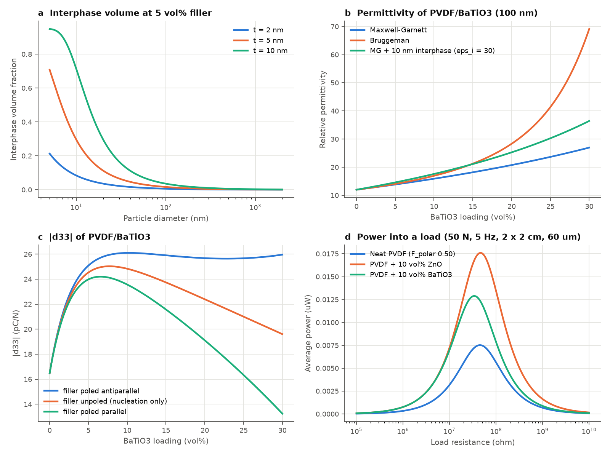

# Interfacial and Piezoelectric Physics of PVDF–Metal Oxide Nanocomposites for Energy Harvesting

This repository combines a written review of the physics governing
poly(vinylidene fluoride) (PVDF) / metal-oxide nanocomposite piezoelectric
energy harvesters with `pvdf_nano`, a small, tested Python toolkit that
implements the models.



*(a) Interphase volume vs particle size; (b) permittivity models for
PVDF/BaTiO3; (c) |d33| vs loading under different filler-poling
conditions; (d) power into a resistive load for neat and filled films.*

## Contents

| Path | What it is |
|---|---|
| [`docs/theory.md`](docs/theory.md) | Review: PVDF polymorphism, phase quantification, interphase structure, polar-phase nucleation mechanisms, Maxwell–Wagner–Sillars polarisation, local field and stress coupling, figures of merit, device output, filler comparison, open problems |
| `pvdf_nano/phases.py` | FTIR β/γ quantification (Gregorio–Cestari, Cai peak-to-valley), DSC crystallinity, Bragg/Scherrer, XRD crystallinity |
| `pvdf_nano/interface.py` | Interphase volume fraction, specific area, interparticle distance, Debye length, surface-field dipole alignment, Tanaka multi-core layers |
| `pvdf_nano/dielectric.py` | Maxwell–Garnett, Bruggeman, Lichtenecker, Yamada, coated-sphere / interphase model, percolation, MWS relaxation |
| `pvdf_nano/piezo.py` | Signed 0-3 composite d33 (matrix + Furukawa filler term), β/γ-weighted polar fraction, electrostrictive filler-d33 scaling, g33, d33·g33 FoM, k33 |
| `pvdf_nano/harvester.py` | Capacitance, charge, V_oc, matched-load power with and without dielectric loss/leakage, bridge-rectifier charging, power density |
| `pvdf_nano/materials.py` | Typical properties of PVDF phases and oxide fillers (ZnO, BaTiO3, PZT, KNN, TiO2, Fe3O4, Al2O3, SiO2) |
| `pvdf_nano/sensitivity.py` | Latin hypercube sampling and Morris elementary-effects screening |
| `pvdf_nano/nucleation.py` | Polar-phase nucleation laws (loading- and interphase-controlled) and least-squares fitting to measured FTIR data |
| `examples/design_study.py` | Generates the figure above and a device comparison table |
| `examples/reproduce_paper.py` | Regenerates every manuscript figure and writes every quoted number to `paper/results/` |
| `paper/manuscript.tex`, `paper/manuscript.pdf` | Revised manuscript (LaTeX) |
| `paper/response_to_reviewer.md`, `paper/response_to_reviewer_round2.md` | Point-by-point responses to the two reviews |
| `environment-lock.txt` | Exact versions used to produce the paper's results |
| `tests/` | pytest suite checking limits, bounds and internal consistency |

## Quick start

```bash
pip install -r requirements.txt
python -m pytest            # run the tests
python examples/design_study.py
python examples/reproduce_paper.py   # manuscript figures and numbers
cd paper && pdflatex manuscript.tex && pdflatex manuscript.tex
```

```python
from pvdf_nano import phases, piezo, harvester
from pvdf_nano.materials import PVDF_BETA, ZNO

# FTIR: absorbances at 763 and 840 cm^-1, peak-to-valley heights at 1275 / 1234
f_ea = phases.electroactive_fraction(a_763=0.12, a_840=0.45)
f_beta, f_gamma = phases.split_beta_gamma(f_ea, dh_1275=0.30, dh_1234=0.05)
x_c = phases.dsc_crystallinity(dh_melt=47.0, filler_wt_fraction=0.05)

d33 = piezo.composite_d33(0.05, x_c, f_beta + f_gamma, PVDF_BETA.eps_r, ZNO.eps_r,
                          PVDF_BETA.youngs_modulus, ZNO.youngs_modulus, ZNO.d33,
                          filler_poling="none")
print(f"d33 = {d33 * 1e12:.1f} pC/N, FoM = {piezo.harvesting_fom(d33, 11.8):.2e} m^2/N")
```

## Main points

1. **The interphase dominates at the nanoscale.** At 5 vol% and a 5 nm
   interphase, about 11 % of a 20 nm-particle composite is interphase,
   against about 0.15 % for 1 µm particles.
2. **Most of the gain from oxides comes from nucleating polar phases.**
   Surface charge, –OH hydrogen bonding, lattice matching and confinement
   pin –CH2–CF2– dipoles and stabilise all-trans β segments.
3. **High-ε piezo-ceramic fillers couple poorly.** For BaTiO3 in PVDF the
   local field coefficient is about 0.02, so the particles are hard to pole
   and contribute little directly.
4. **Sign matters.** PVDF has d33 < 0 while oxide ceramics have d33 > 0.
   Co-poled phases partially cancel; antiparallel poling makes them add.
5. **Optimise d33·g33, not d33.** Fillers that raise permittivity can
   lower harvested energy even when they raise d33.

## Scope and caveats

The models are first-order and phenomenological. They are meant for
building intuition, interpreting trends, and sizing experiments, not for
predicting the absolute output of a particular sample. Material constants
in `materials.py` are representative values and depend strongly on
processing. The β-nucleation law in the example script is illustrative;
replace it with your own FTIR/DSC data.
